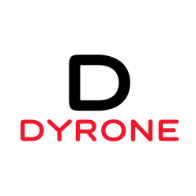

# Hi, I'm dyrone :wave:

Software Engineer, Husband, Father, Senile Hoopster.

## Life

:shipit: [**AIS (Alibaba Infrastructure), Alibaba**] SDE II, Middle Platform, Code Service  
:shipit: [**R&D Efficiency Department, Alibaba**] SDE II, Self-developed code hosting system  
:shipit: [**UTC(underlying tech of code), Alibaba**] Senior SDE, Codesearch, Git  
:shipit: [**UTC, Alicloud**] Senior SDE, svn offline to git, Gerrit distributed Architecture  
:shipit: [**UTC, Alicloud**] Staff SDE, multiple-replica git architecture(Galileo, similar to Github Spokes)  
:shipit: [**UTC, Alicloud**] Staff SDE, leader of UTC git tech  
:shipit: [**UTC, Alicloud**] Staff SDE, PM, codeup.aliyun.com and atomgit.com(beta)

## Skills

    <b>Looking for an opportunity to join the field of code technology?
        <a href="mailto: dyroneteng@gmail.com">Let's connect and talk!</a>
    </b>

### Interests

:fishsticks: **Git committer:** 

I have been participating in the Git community contribution since 2021. As an
11-year java developer, it is not easy to pick up the C language again, because
my usual work content is more complicated, but I am participating and growing as
much as possible.

My activities in Git Community: https://lore.kernel.org/git/?q=Teng+Long

:fishsticks: **Gerrit committer:**

In the process of implementing the distributed architecture of Gerrit in
Alibaba, I made some commits to the core of Gerrit. Gerrit is implemented in
Java, so it is more comfortable for me. However, due to the work focus, I have
little time to contribute, but I still pay close attention to the development of
Gerrit frequently.

My activities in Gerrit Community: http://gerrit-review.googlesource.com/q/dyroneteng@gmail.com

and also formed some interesting disorganized materials, which are:

:ice_cream: [**Git Rev News #95 interview**](https://git.github.io/rev_news/2023/01/31/edition-95/ "Git Rev News #95 interview")  
:ice_cream: [**Code transparent encryption based on Git**](https://mp.weixin.qq.com/s/i5oHyDz-UiFdYXTku8cGLw)  
:ice_cream: [**Git objects and reference principles**](https://mp.weixin.qq.com/s/UTETcreecYfotJzlR1fAkw)  
:ice_cream: [**Git objects and reference principles(Bilibili)**](https://www.bilibili.com/video/BV1a44y1b7tm)  
:ice_cream: [**计算机历史博物馆采访(Computer History Museum interview)**](https://www.xiaoyuzhoufm.com/episode/63ea3205e99bdef7d39ea6d8)  
:ice_cream: [**One of the editorial boards of Efficient Coding: A Java Development Manual (Easy Coding)**](https://github.com/alibaba/p3c/blob/master/Java%E5%BC%80%E5%8F%91%E6%89%8B%E5%86%8C(%E9%BB%84%E5%B1%B1%E7%89%88).pdf)  
:ice_cream: **Alibaba Cloud 2020 Top 10 Technology Architecture Award: Multi-master architecture based on Git**

---

<!---->

